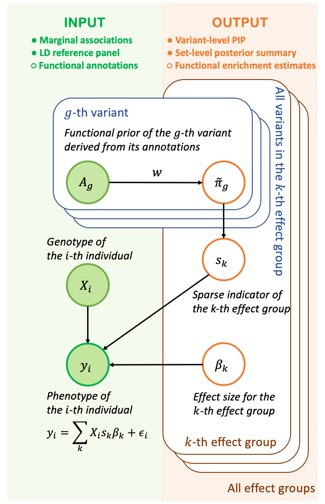

# SparsePro for fine-mapping with summary statistics and functional annotations

SparsePro is a command line tool for efficient and accurate fine-mapping. 

## Overview 



Identifying causal variants from genome-wide association studies (GWASs) is challenging due to widespread linkage disequilibrium (LD) and possible existence of multiple causal variants in the same genomic locus. Functional annotations of the genome may help to prioritize variants that are biologically relevant and thus improve fine-mapping of GWAS results.

To fine-map causal variants, SparsePro takes two lines of evidence. First, with GWAS summary statistics and matched LD information, we jointly infer both the causal status of each effect group for traits as well as variant representation within each effect group. Second, we estimate the functional enrichment of causal variants and prioritize variants according to relevant functional information. As outputs, our method yields variant-level PIP estimates, set-level posterior summary as well as enrichment estimates of functional annotations.

## Installation

SparsePro was developed under Python 3.9.7 environment but should be compatible with older versions of Python 3. The following Python modules are required:

* [numpy](http://www.numpy.org/) (version==1.21.3)
* [scipy](http://www.scipy.org/) (version==1.7.1)
* [pandas](https://pandas.pydata.org/getpandas.html) (version==1.3.4)

To install SparsePro:

```
git clone https://github.com/zhwm/SparsePro.git
cd SparsePro
pip install -r requirements.txt 
gunzip dat/ld.txt.zip
``` 

To test the installation and display basic usage:
```
$> python sparsepro_zld.py -h
usage: sparsepro_zld.py [-h] [--zld ZLD] --zdir ZDIR --N N --save SAVE --prefix PREFIX [--verbose] [--anno ANNO] [--K K]
                        [--pthres PTHRES] [--sthres STHRES] [--aW AW] [--h2]

SparsePro Commands:

optional arguments:
  -h, --help       show this help message and exit
  --zld ZLD        locus finemapping mode: path to matched zscore and ld lists (or annotation file)
  --zdir ZDIR      path to zscores files
  --N N            GWAS sample size
  --save SAVE      path to save result
  --prefix PREFIX  prefix for result files
  --verbose        options for displaying more information
  --anno ANNO      name of the annotation column in zld file
  --K K            largest number of effect groups
  --pthres PTHRES  p value threshold for enrichment
  --sthres STHRES  level for representation of effect group
  --aW AW          significant enriched file
  --h2             use previous h2 file as zld file

```

## Input files

Example input files are included in the [dat](dat/) directory.

SparsePro takes in a summary file of loci to be finemapped, z-scores files, LD files and annotations as inputs.

1. **a summary file** contains two mandatory columns: names of z-score file and ld files. Optionally, names for annotation files can be included in the third column. An example can be find at [dat/zldanno.txt](dat/zldanno).

2. **zscore files** that contains two mandatory columns: variant IDs and z-scores. An example can be find at [dat/C1.txt](dat/C1.txt).

3. **LD files** that contains Pearson correlation coefficient matrix. **Please make sure the REF/ALT alleles used in calculating LD are the same with the GWAS study!!** An example can be find at [dat/ld.txt](dat/ld.txt).

4. (optional) **annotation file** with entries indicating annotations status for variants. An example can be find at [dat/anno.txt](dat/anno.txt).


## Usage

### Fine-mapping with GWAS summary statistics only

```
$> python sparsepro_zld.py --zld dat/zldanno.txt --zdir dat --N 353570 --save result_no --prefix result_no --verbose --K 5 
```

### Fine-mapping with GWAS summary statistics and estimate annotation enrichment

```
$> python sparsepro_zld.py --zld dat/zldanno.txt --zdir dat --N 353570 --save result_no --prefix result_no --verbose --K 5 --anno anno --pthres 1e-5
```

### Fine-mapping with both GWAS summary statistics and functional annotation information

```
$> python sparsepro_zld.py --zld result_no/result_no.h2.txt --zdir dat --N 353570 --save result_anno --prefix result_anno --verbose --K 5 --anno anno --aW result_no/result_no.W1e-05.txt
```

## Output interpretation

1. **variant-level PIP** (pip.txt) file contain four columns: variant ID, z-scores, PIP, effect group for each variants (-1 stands for none). 

```
$> head C1.txt.pip.txt
rs138862362	0.330197	0.0	-1
rs190750807	0.0329643	0.0	-1
rs9609016	-0.4942	0.0	-1
rs117492340	-2.12801	0.0	-1
rs572332074	4.38025	0.3072	-1
rs202128203	-1.84605	0.0	-1
rs55679829	-0.286135	0.0	-1
rs62227035	-1.00044	0.0	-1
rs5753228	1.15621	0.0	-1
rs5753229	1.50095	0.0	-1

```

2. **set-level summary** (cs.txt) file contains three columns: the cs column contains variants included in each effect group; the pip column contains variant representation probabilities in each effect group; the last column contains corresponding effect sizes.

```
$> head C1.txt.cs.txt             
cs	pip	beta
rs557364786	0.9887	0.0118
rs117728004	1.0	0.0107
rs80055673/rs117981957	0.904/0.0546	0.0092/0.0084
rs182440662/rs183772757	0.9135/0.0701	0.0085/0.0077
```

3. **relevant functional enrichment estimates** (W1e-05.txt) file contains four columns: the ANNO column contains the name of relevant annotations in the [annotation file](dat/anno.txt) file and sigidx column indicates the correpsonding column index. The W_sig contains log-relative enrichment estimates and the W_se_sig contains the standard errors.

```
$> head result_no.W1e-05.txt 
ANNO	W_sig	W_se_sig	sigidx
Conserved_LindbladToh	0.5446063424172001	0.3317510299522505	0
DHS_Trynka	1.6161449592738593	0.33786446185529295	1
H3K4me3_Trynka	1.6502986956301235	0.3707498550464284	3
non_synonymous	1.998143007010202	0.4104086444818378	8
```

4. **heritability estimates** (h2.txt) file contains heritability estimates used for specifying prior and can be provided to `--zld` with `--h2`.

```
$> head result_no.h2.txt 
z	ld	anno	h2	pval	varb	K
C1.txt	ld.txt	anno.txt	5.31e-04	1.13e-12	1.43e-04	5.00e+00
C2.txt	ld.txt	anno.txt	5.25e-04	3.00e-14	1.63e-04	5.00e+00
C3.txt	ld.txt	anno.txt	4.95e-04	6.92e-10	1.08e-04	5.00e+00
C4.txt	ld.txt	anno.txt	5.84e-04	1.42e-14	1.67e-04	5.00e+00
C5.txt	ld.txt	anno.txt	4.94e-04	1.14e-12	1.43e-04	5.00e+00
C6.txt	ld.txt	anno.txt	5.03e-04	1.20e-11	1.30e-04	5.00e+00
C7.txt	ld.txt	anno.txt	5.44e-04	5.43e-13	1.47e-04	5.00e+00
C8.txt	ld.txt	anno.txt	4.65e-04	2.86e-13	1.51e-04	5.00e+00
C9.txt	ld.txt	anno.txt	7.51e-04	0.00e+00	2.41e-04	5.00e+00
```

## Citations

If you use this software, please cite:

[Wenmin Zhang, Hamed Najafabadi, Yue Li. SparsePro: an efficient genome-wide fine-mapping method integrating summary statistics and functional annotations. bioRxiv 2021.10.04.463133](https://doi.org/10.1101/2021.10.04.463133)

